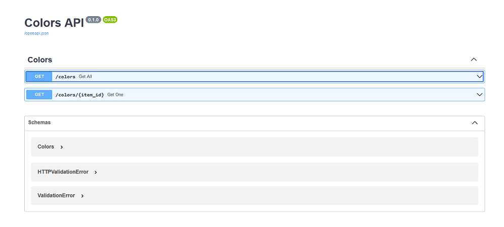

# datarest: Python low code data-driven REST-Tool

Datarest exposes your tabular data as a simple REST API.

* License: Mozilla Public License 2.0
* Documentation: https://github.com/hjoukl/datarest

## Installation and usage
### Installation
Create virtualenv:

```
python -m venv datarest-venv
```

Install datarest:

```
./datarest-venv/bin/pip install git+https://github.com/hjoukl/datarest
```

### Example usage
Create a sample CSV data file colors.csv:

```
no,color,description
1,red,The color of blood
2,green,The color of hope
3,blue,The color of oceans
4,yellow,Bright as the sun
5,black,Dark as the night
```

Initalize the datarest project:
```
./datarest-venv/bin/datarest init datafile --expose get_all --expose get_one \
colors.csv 
```

This creates a basic app configuration plus a
[data resource](https://specs.frictionlessdata.io/data-resource/) description
with a [table schema](https://specs.frictionlessdata.io/table-schema/) for our
CSV file and loads the CSV data into the (default) SQLite database:

```
0 $ cat app.yaml  # the app configuration
datarest:
  fastapi:
    app:
      title: Colors API
      description: ''
      version: 0.1.0
  database:
    connect_string: sqlite:///app.db
  datatables:
    colors:
      schema_spec: https://specs.frictionlessdata.io/data-resource/
      schema: colors.yaml
      dbtable: colors
      paginate: 10
      expose_routes:
      - get_all
      - get_one

0 $ cat colors.yaml  # the colors data resource description
name: colors
profile: tabular-data-resource
scheme: ''
format: inline
schema:
  fields:
    - name: id_
      description: Unique resource id
      type: string
    - type: integer
      name: no
      example: 1
    - type: string
      name: color
      example: red
    - type: string
      name: description
      example: The color of blood
  primaryKey:
    - id_
  x_datarest_primary_key_info:
    id_type: uuid4_base64
    id_src_fields:
      - no

0 $ sqlite3 app.db '.schema'  # the resulting database schema
CREATE TABLE colors (
    id_ TEXT, 
    no INTEGER, 
    color TEXT, 
    description TEXT, 
    PRIMARY KEY (id_)
);
```

Fire up a fully functional data-driven REST API:

```
# use datarest run --host 0.0.0.0 to accept non-localhost connections
./datarest-venv/bin/datarest run
```

The built-in [Swagger UI](https://swagger.io/tools/swagger-ui/) and
[ReDoc](https://github.com/Redocly/redoc) documentation can now be used to
try out and learn about the API:
- Swagger UI: http://localhost:8000/docs
- ReDoc: http://localhost:8000/redoc



Optionally, modify the app configuration and/or data resource schema to add
information, reflected in the REST API docs:
```
0 $ cat colors.yaml  # enhanced the colors data resource description
name: colors
profile: tabular-data-resource
scheme: ''
format: inline
schema:
  fields:
    - name: id_
      description: Unique resource id
      type: string
    - type: integer
      description: Color number
      name: no
      example: 1
    - type: string
      description: Color name
      name: color
      example: red
    - type: string
      name: description
      description: Color descrption
      example: The color of blood
  primaryKey:
    - id_
  x_datarest_primary_key_info:
    id_type: uuid4_base64
    id_src_fields:
      - no
```

## Standing on the shoulders of giants
Powered by the great
- [FastAPI](https://github.com/tiangolo/fastapi)
- [FastAPI CRUD Router](https://github.com/awtkns/fastapi-crudrouter)
- [Frictionless framework](https://github.com/frictionlessdata/frictionless-py)
- [SQLAlchemy](https://www.sqlalchemy.org/)
- [SQLModel](https://github.com/tiangolo/sqlmodel)
